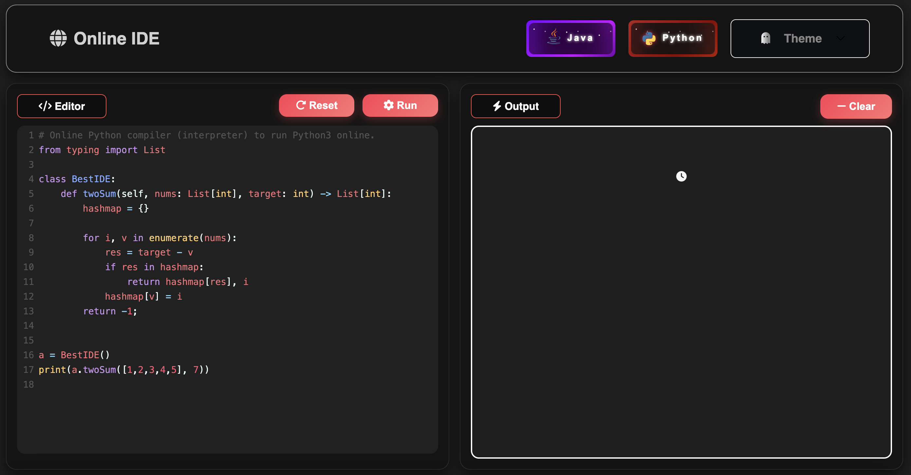
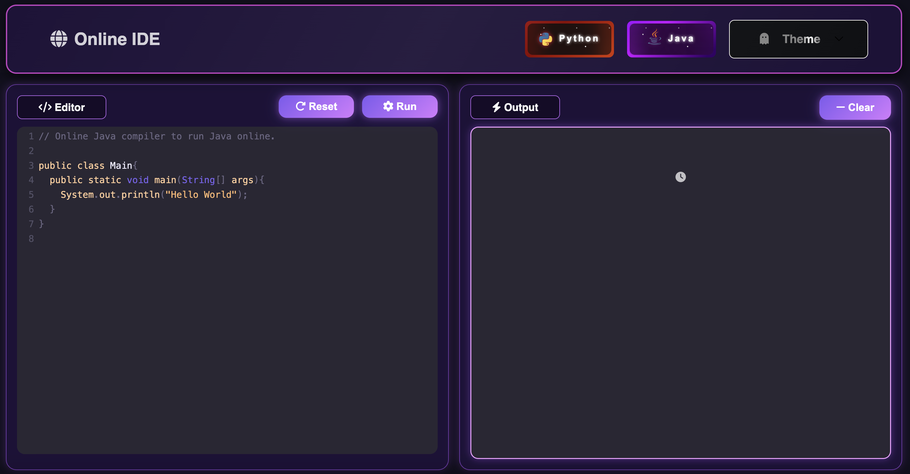

# Online IDE Compiler — Python & Java Support

A sleek, fully functional **web-based IDE compiler** for Python and Java. Designed with a modern UI/UX approach, this project enables users to write, execute, and view code outputs in real-time through an elegant and intuitive interface. Each code IDE is differentiated with their respective theme colors, creating an elegant balance between user interactions.

# Manifesto

With the recent surge in IDE applications like Kiro and Claude-based platforms, I sought to develop an accessible Online coding platform that users can utilize whether it be within occupational, professional or leisurely environments. In the future, it is Artifical Intelligence that will reep those who sow.

<div align="center">
  
  
</div>

## 🚀 Features

- 🧠 **Real-Time Code Execution**: Supports Python and Java.
- 🎨 **Modern Synthwave + Dark Theming**: Duotone-Dark, Dracula, Pale Night, Material-Darker.
- 🧪 **Live Output Console**: Displays code output instantly, with clear error handling.
- ⚙️ **CodeMirror Editor**: Fully integrated with syntax highlighting and key IDE features.
- 📱 **Responsive UI**: Mobile and tablet-friendly layout.
- 🔁 **Refresh, Run & Clear Controls**: Smooth GSAP animations and clean UX transitions.
- 🎭 **Language Switching**: Navigate between Python and Java environments seamlessly.

## 🛠️ Built With

- **Frontend**:
  - HTML5, CSS3, JavaScript
  - CodeMirror 6
  - GSAP (GreenSock)
  - Font Awesome
- **Backend**:
  - Python 3
  - Flask
  - `subprocess` for code execution
- **Deployment**:
  - Render.com

## ⚙️ Setup & Usage

### 📦 Prerequisites

Ensure when running:

```
- Python 3.x
- Java (JDK) installed and accessible from terminal
- `pip` for installing Flask
```

## Navigation

```
http://localhost:5000/python for Python IDE
http://localhost:5000/java for Java IDE
```

## Project Structure
```
.
├── static/
│   ├── css/
│   ├── js/
│   ├── images/
├── templates/
│   ├── index.html         # Python IDE
│   ├── java.html          # Java IDE
├── app.py                 # Flask backend logic
├── requirements.txt
├── README.md
├── python.png (for showcase)
└── java.png (for showcase)
```

## 🌟 Future Improvements

- Add support for C/C++ and JavaScript

- User authentication for saved code

- Real-time collaborative editing

- Theming customization for users

- Output highlighting & file uploads

- Custom language requests

## ✨ Acknowledgments
Thanks to:

CodeMirror for providing the excellent in-browser code editor

GSAP for making interactions fluid and enjoyable

Flask for powering the backend with simplicity

Java and Python for providing an efficient and simple facility for programmers


